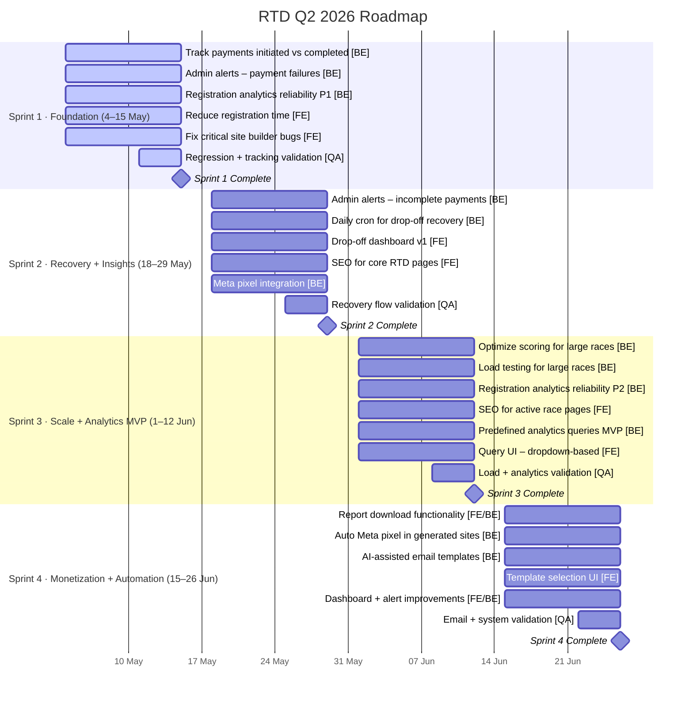

# RTD 2026 Q2 Roadmap

## Overview
Run The Day Product Roadmap for Q2 2026 (May–June)

---

## Sprint 1: Foundation (Funnel + Stability)
**Dates:** 4th–15th May 2026 (W1–2)

| Initiative | Deliverable | Owner | Priority | Dependency | Outcome |
|-----------|-------------|-------|----------|-----------|---------|
| 1.2 | Track initiated vs completed payments | BE | High | – | Funnel visibility established |
| 7.3 | Admin alerts for payment failures | BE | High | – | Faster issue detection |
| 5.3 (P1) | Registration analytics reliability (logging fixes) | BE | High | – | Clean data layer |
| 1.1 | Reduce registration time | FE | High | – | No solution/approach so far |
| 4.1 | Fix critical site builder bugs | FE | High | – | Removes adoption blockers |
| QA | Regression + tracking validation | QA | High | – | Data accuracy ensured |

**Focus:** Establish foundation for payment funnel and site stability.

---

## Sprint 2: Recovery + Insights
**Dates:** 18th–29th May 2026 (W3–4)

| Initiative | Deliverable | Owner | Priority | Dependency | Outcome |
|-----------|-------------|-------|----------|-----------|---------|
| 1.3 | Admin alerts for incomplete payments | BE | High | 1.2 | Recovery trigger enabled |
| 1.4 | Daily cron for drop-off recovery | BE | High | 1.2 | Automated recovery system |
| 1.5 | Drop-off dashboard (v1) | FE | High | 1.2 | Actionable insights |
| 3.1 | SEO for core RTD pages | FE | High | – | Organic traffic base |
| 3.3 | Meta pixel integration (global) | BE | High | – | Attribution tracking |
| QA | Recovery flow validation | QA | High | – | End-to-end correctness |

**Focus:** Enable payment recovery and insights while improving organic traffic.
**Dependencies:** Requires Sprint 1 completion (1.2).

---

## Sprint 3: Scale + Analytics MVP
**Dates:** 1st–12th June 2026 (W5–6)

| Initiative | Deliverable | Owner | Priority | Dependency | Outcome |
|-----------|-------------|-------|----------|-----------|---------|
| 2.2 | Optimize scoring for large races | BE | High | – | Scale readiness |
| 2.3 | Load testing for large races | BE | High | 2.2 | Failure thresholds known |
| 5.3 (P2) | Registration analytics reliability (complete) | BE | High | P1 | Trusted reporting |
| 3.2 | SEO for active race pages | FE | High | – | Traffic expansion |
| 5.1 (MVP) | Predefined analytics queries (no NLP) | BE | Medium | 5.3 | Faster insights access |
| 5.1 (MVP) | Query UI (dropdown-based) | FE | Medium | 5.3 | Usable analytics layer |
| QA | Load + analytics validation | QA | High | – | Stability ensured |

**Focus:** Ensure system scales for large races and deliver analytics MVP.
**Dependencies:** Requires Sprint 1 (5.3 P1), Sprint 3 work (5.3 P2).

---

## Sprint 4: Monetization + Automation
**Dates:** 15th–26th June 2026 (W7–8)

| Initiative | Deliverable | Owner | Priority | Dependency | Outcome |
|-----------|-------------|-------|----------|-----------|---------|
| 5.4 | Report download functionality | FE/BE | Medium | 5.1 | Export capability |
| 4.5 | Auto Meta pixel in generated sites | BE | Medium | 3.3 | Reduces manual setup |
| 8.1 (MVP) | AI-assisted email templates | BE | Medium | – | Faster email creation |
| 8.1 (MVP) | Template selection UI | FE | Medium | – | Simple UX |
| – | Dashboard + alert improvements | FE/BE | Medium | – | UX polish |
| QA | Email + system validation | QA | High | – | Release readiness |

**Focus:** Enable monetization paths and improve user automation.
**Dependencies:** Requires Sprint 3 (5.1 analytics), Sprint 2 (3.3 pixel integration).

---

## Timeline Visualization

---

## Key Milestones

- **May 15th:** Sprint 1 Complete - Payment funnel foundation stable
- **May 29th:** Sprint 2 Complete - Recovery system and insights operational
- **June 12th:** Sprint 3 Complete - System ready to scale, analytics MVP ready
- **June 26th:** Sprint 4 Complete - Monetization features live, automation enabled

---

## Owner Summary

| Owner | Sprint 1 | Sprint 2 | Sprint 3 | Sprint 4 | Total |
|-------|----------|----------|----------|----------|-------|
| **BE** | 3 | 3 | 3 | 2 | 11 |
| **FE** | 2 | 2 | 2 | 3 | 9 |
| **FE/BE** | – | – | – | 1 | 1 |
| **QA** | 1 | 1 | 1 | 1 | 4 |
| **Total** | **6** | **6** | **7** | **6** | **25** |

---

## Priority Distribution

| Priority | Count |
|----------|-------|
| High | 18 |
| Medium | 7 |

---

## Dependencies Overview

- **Sprint 1 → Sprint 2:** 1.2 (payments) required for 1.3, 1.4, 1.5
- **Sprint 2 → Sprint 3:** 5.3 P1 required for 5.3 P2; 3.3 (pixel) required for 4.5
- **Sprint 3 → Sprint 4:** 5.1 (analytics) required for 5.4; 3.3 (pixel) required for 4.5

---

## Notes

- All deliverables are scoped and prioritized for Q2 2026.
- Dependencies ensure proper sequencing across sprints.
- QA validation is included in each sprint.
- Two initiatives span multiple sprints: 5.3 (analytics, P1→P2) and 5.1 (analytics queries).

